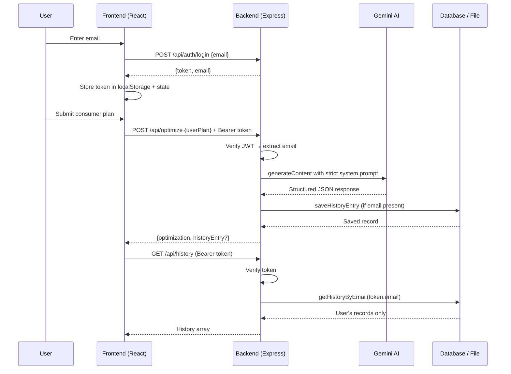

# SmartSwap Architecture & Full-Stack Specialties

This document provides a deeper look at the architecture, data flow, and the specific design choices that make SmartSwap a strong full-stack example.

---

## High-Level Architecture

```
┌─────────────────────────────────────────────────────────────┐
│                        BROWSER (React SPA)                   │
│  ┌──────────────┐   ┌──────────────┐   ┌──────────────────┐ │
│  │  Landing     │   │  Login       │   │  Dashboard       │ │
│  │  Page        │──▶│  (Email)     │──▶│  + History       │ │
│  └──────────────┘   └──────────────┘   │  Sidebar         │ │
│                                          └──────────────────┘ │
│  ┌───────────────────────────────────────────────────────┐   │
│  │  Share Page (public, no auth required)                │   │
│  └───────────────────────────────────────────────────────┘   │
│                                                               │
│  Client uses:                                                 │
│  - React 19 + Vite + React Router                             │
│  - localStorage for JWT persistence                           │
│  - Defensive fetch helpers (check Content-Type before .json())│
│  - Inline styles for rapid development                        │
└─────────────────────────────────────────────────────────────┘
                              │
                              │ HTTPS / HTTP (localhost:5173)
                              ▼
┌─────────────────────────────────────────────────────────────┐
│                      BACKEND (Node + Express)                │
│                                                               │
│  Middleware Stack:                                            │
│  ┌──────────┐  ┌──────────┐  ┌──────────────┐  ┌──────────┐ │
│  │ Helmet   │  │ CORS     │  │ Rate Limit   │  │ Logging  │ │
│  └──────────┘  └──────────┘  └──────────────┘  └──────────┘ │
│                                                               │
│  Routes:                                                      │
│  • POST /api/auth/login          → Issues JWT                 │
│  • POST /api/optimize            → Gemini AI + optional save  │
│  • GET  /api/history             → Protected, user-scoped     │
│  • GET  /api/history/:id         → Public (for sharing)       │
│  • DELETE /api/history/:id       → Protected + ownership      │
│                                                               │
│  AI Layer:                                                    │
│  - Google Gemini 2.5 Flash                                    │
│  - Very strict system prompt                                  │
│  - responseMimeType: "application/json"                       │
│  - Enforced output schema                                     │
│                                                               │
│  Data Layer:                                                  │
│  - Mongoose (MongoDB Atlas)  OR                               │
│  - Local history_db.json fallback                             │
│                                                               │
│  Auth: JWT (jsonwebtoken) + ownership checks                  │
└─────────────────────────────────────────────────────────────┘
                              │
                    (Optional) MongoDB Atlas
                              │
                    Local File: history_db.json
```

---

## Data Flow Example: Login + Optimize

1. User enters email on frontend
2. Frontend calls `POST /api/auth/login` with `{ email }`
3. Backend:
   - Validates email format
   - Creates JWT with payload `{ email: normalizedEmail }`
   - Returns `{ token, email }`
4. Frontend stores the full object in state + localStorage
5. User submits a plan → `POST /api/optimize` with `{ userPlan }` + `Authorization` header
6. Backend:
   - Verifies JWT (if present) → extracts email
   - Calls Gemini with strict system instruction
   - Parses JSON response
   - If email present → saves to DB (Mongo or local JSON)
   - Returns result
7. Frontend receives data, updates UI, refreshes history list via `GET /api/history` (token-protected)

---

## Security Architecture (The "Intact Security Layer")

Special focus was put on making auth real while keeping UX smooth:

- **No passwords** — email-only login reduces friction
- **Stateless JWT** — 7-day expiry, signed with secret (or dev fallback)
- **Protected Routes** use `authenticateToken` middleware
- **Ownership Enforcement** on DELETE and listing (email from token vs email in record)
- **Public vs Private**:
  - `/api/history/:id` (GET) → intentionally public
  - Everything else that mutates or lists personal data → requires valid token
- **Client-side hardening**:
  - Checks `Content-Type` before parsing JSON
  - Auto logout on 401/403 during protected calls
- **Other protections**:
  - Helmet (headers)
  - Rate limiting per IP
  - CORS whitelist (flexible for dev ports)
  - Request logging for observability

---

## Text-Based Architecture Diagram (ASCII + Mermaid style)

### Component View

```
User
  │
  ▼
Frontend (Vite + React)
  ├── Landing (public)
  ├── Login → calls /auth/login → receives JWT
  ├── Dashboard (requires token)
  │     ├── Submit plan → /optimize (with token)
  │     ├── History list → /history (with token)
  │     └── Share button → copies /share/:id link
  └── Share View (no token needed)
  │
  ▼ (fetch with Authorization header when logged in)
Backend (Express)
  ├── Auth Middleware (JWT verification)
  ├── AI Service (Gemini structured output)
  ├── History Service
  │     ├── MongoDB (if configured)
  │     └── JSON File Fallback
  └── Public Share Route (no auth)
```

### Mermaid Diagram (copy-paste into any Markdown renderer that supports Mermaid)



---

## Key Specialties That Make This Full-Stack

| Specialty                        | How It's Implemented                                                                 | Why It Matters |
|----------------------------------|--------------------------------------------------------------------------------------|---------------|
| **AI Structured Output**        | Strict system prompt + `responseMimeType: application/json`                         | Prevents hallucinated free text; enables reliable UI rendering |
| **Token-based Auth (Smooth)**   | Email → real JWT (no passwords) + Bearer header                                     | Real security without login friction |
| **Ownership + Public Sharing**  | JWT for private ops + unauthenticated GET on `/history/:id`                         | Classic "shareable but secure" pattern |
| **Graceful DB Degradation**     | Mongoose try → catch → local JSON file                                              | Works out of the box, easy onboarding |
| **Defense in Depth (Security)** | Helmet + rate limit + CORS + logging + client-side JSON guards                      | Production-ready practices |
| **Observability**               | Simple request logging middleware + monitorable dev servers                         | Easy debugging during development |
| **Client Resilience**           | Content-Type checks + clear error messages instead of raw JSON.parse failures       | Better UX when things go wrong |
| **SPA + Pure API Backend**      | Frontend does all routing and UI; backend is JSON-only                              | Clean separation of concerns |
| **Modern Tooling**              | Vite + React 19 + Express 5 + no unnecessary dependencies                           | Fast builds, small footprint |

---

## Trade-offs & Design Decisions

- **Inline styles instead of Tailwind/CSS modules** — Speed of development and focus on backend/AI/auth logic.
- **All-in-one App.jsx** — The frontend is intentionally simple so the full-stack story is easy to follow.
- **No separate user collection** — Email string inside history documents is enough for this scope (keeps things simple).
- **Dev JWT fallback** — If no `JWT_SECRET` is set, it uses an insecure default (warns loudly). Good for local dev, bad for production.
- **Rate limits are conservative** — Protects the (paid) Gemini quota during development and demos.

---

This architecture strikes a good balance between realism and educational clarity. It shows how to integrate AI, auth, resilient data, security, and sharing in a single coherent full-stack application.