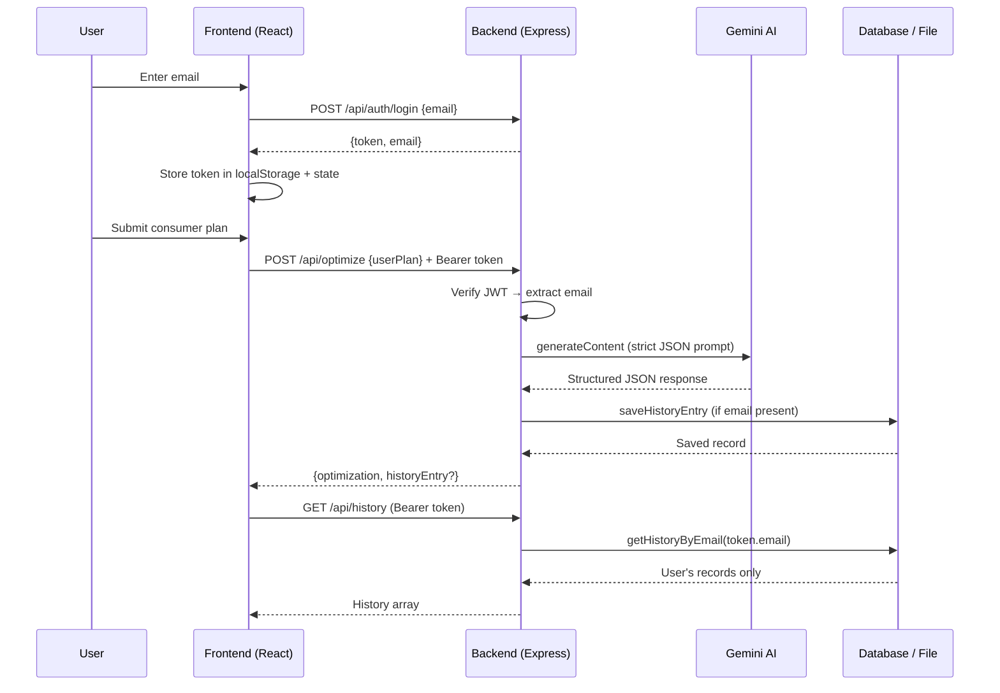

# SmartSwap Architecture & Full-Stack Specialties

Deep dive into architecture, data flow, deployment, testing, and design choices.

**Live:** [https://smartswap-8yvv.onrender.com](https://smartswap-8yvv.onrender.com)

---

## High-Level Architecture

```
┌─────────────────────────────────────────────────────────────┐
│                   BROWSER (React SPA — Vite)                 │
│                                                               │
│  App.jsx (router shell, auth state, lazy-loaded routes)      │
│  ├── LandingPage      (public)                               │
│  ├── LoginPage        (email → JWT)                          │
│  ├── DashboardPage    (protected — token in memory/storage)  │
│  └── SharedSwapPage   (public — /share/:id)                  │
│                                                               │
│  Shared: OptimizationResult, Navbar, useDocumentTitle         │
│  Client: localStorage JWT, apiUrl() helper, defensive fetch  │
└─────────────────────────────────────────────────────────────┘
                              │
                              │ HTTP(S) — same origin in production
                              ▼
┌─────────────────────────────────────────────────────────────┐
│              BACKEND (Node 20 + Express 5 — Docker)          │
│                                                               │
│  Middleware: Helmet → compression → CORS → JSON → logging    │
│                                                               │
│  Routes:                                                      │
│  • GET  /api/health              → Liveness probe             │
│  • POST /api/auth/login          → Issues JWT                 │
│  • POST /api/optimize            → Gemini AI + optional save  │
│  • GET  /api/history             → Protected, user-scoped     │
│  • GET  /api/history/:id         → Public (sharing)           │
│  • DELETE /api/history/:id       → Protected + ownership      │
│  • GET  /* (non-API)            → Serves frontend/dist SPA     │
│                                                               │
│  Lib modules (backend/lib/):                                  │
│  • cors.js           → Origin policy (unit-tested)            │
│  • offlineFallback.js → Demo-mode AI responses (unit-tested)  │
│                                                               │
│  Data: Mongoose (MongoDB Atlas) OR history_db.json fallback   │
└─────────────────────────────────────────────────────────────┘
```

---

## Production Deployment Architecture

```
GitHub (main branch)
        │
        │ push triggers
        ▼
┌──────────────────┐     ┌─────────────────────────────────┐
│ GitHub Actions   │     │ Render (Docker web service)        │
│ CI: test+lint+   │     │                                   │
│ build            │     │ Dockerfile (multi-stage):         │
└──────────────────┘     │  1. npm ci + vite build (frontend)│
                         │  2. npm ci + node server (backend) │
                         │  3. COPY dist → /app/frontend/dist │
                         │                                   │
                         │ Env: GEMINI_API_KEY, JWT_SECRET,  │
                         │      MONGODB_URI, NODE_ENV=prod   │
                         │ Health: GET /api/health           │
                         └─────────────────────────────────┘
```

Render Blueprint (`render.yaml`):
- `runtime: docker` — builds from `Dockerfile`, serves API + static SPA
- `autoDeploy: true` — deploys on every push to `main`
- `healthCheckPath: /api/health`

---

## Frontend Architecture

### Component map

| Component | Route | Auth | Responsibility |
|-----------|-------|------|----------------|
| `LandingPage` | `/` | No | Marketing, feature cards (`<article>`) |
| `LoginPage` | `/login` | No | Email login form |
| `DashboardPage` | `/dashboard` | Yes | Optimize form, history sidebar, results |
| `SharedSwapPage` | `/share/:id` | No | Public read-only result view |
| `Navbar` | all | — | Primary navigation, logout |
| `OptimizationResult` | — | — | Shared result display (dashboard + share) |

### Performance

- **Lazy loading** — route components loaded via `React.lazy` + `Suspense`
- **Code splitting** — Vite emits separate chunks per page (visible in `dist/assets/`)
- **`useDocumentTitle`** — per-route `<title>` for accessibility and SEO

### API client

`frontend/src/config.js`:

```javascript
// Production (same-origin): API_BASE = ''
// Development: API_BASE = 'http://localhost:5000'
export function apiUrl(path) { ... }
```

Vite dev server proxies `/api` → `localhost:5000`.

---

## Backend Architecture

### Middleware stack (order matters)

1. `helmet()` — security headers
2. `compression()` — gzip responses
3. `cors()` — dynamic origin check via `lib/cors.js`
4. `express.json({ limit: '1mb' })`
5. Request logger
6. Route handlers
7. Static file serving (`frontend/dist`) + SPA fallback

### AI pipeline (`generateOptimization`)

```
userPlan
   │
   ├─ No GEMINI_API_KEY? → offlineFallback (immediate)
   │
   └─ Try models: gemini-2.5-flash → gemini-2.0-flash → gemini-2.0-flash-lite
         │
         ├─ Success → parse JSON → return
         ├─ Retryable error → exponential backoff, retry
         ├─ Fatal error (invalid key) → 500
         └─ All models fail → offlineFallback with reason
```

### Data layer

| Operation | MongoDB mode | Fallback mode |
|-----------|-------------|---------------|
| Save history | `History.save()` | Append to `history_db.json` |
| List by email | `History.find({ email })` | Filter local JSON array |
| Get by ID | `History.findById()` | Find in local JSON |
| Delete | `History.deleteOne()` + ownership check | Filter + rewrite file |

---

## Data Flow: Login + Optimize



---

## Security Architecture

| Concern | Implementation |
|---------|---------------|
| Authentication | Email → JWT (7-day), `authenticateToken` middleware |
| Authorization | Email from token compared to record owner on delete |
| CORS | Localhost ports + `FRONTEND_ORIGIN` + `RENDER_EXTERNAL_URL` + same-host matching |
| Rate limiting | Optimize: 25/15min, History: 60/10min per IP |
| Headers | Helmet.js |
| Compression | gzip via `compression` middleware |
| Input validation | Email format, plan min length, JSON body limit |
| Production gates | Exit if `JWT_SECRET` or `GEMINI_API_KEY` missing when `NODE_ENV=production` |
| Public by design | `GET /api/history/:id` for share links |

See [SECURITY.md](./SECURITY.md) for full details.

---

## Testing Architecture

### Backend (25 tests — Node test runner + supertest)

| File | Coverage |
|------|----------|
| `tests/api.test.js` | Health, login, optimize, history auth, delete auth |
| `tests/cors.test.js` | Origin policy for localhost, same-host, external |
| `tests/offlineFallback.test.js` | Travel, gadget, food, generic plan detection |

Run: `npm test` in `backend/`

### Frontend (16 tests — Vitest + Testing Library + axe)

| File | Coverage |
|------|----------|
| `App.test.jsx` | Landing, skip link, login nav, landmarks |
| `a11y.test.jsx` | axe-core audits on Landing, Login, OptimizationResult |
| `components/*.test.jsx` | Page and component behavior |
| `hooks/useDocumentTitle.test.jsx` | Document title updates |
| `config.test.js` | API URL helper |

Run: `npm test` in `frontend/`

### CI (`.github/workflows/ci.yml`)

On every push/PR to `main`:
1. `npm ci` (backend + frontend)
2. `npm test` (both)
3. `npm run lint` (frontend)
4. `npm run build` (frontend)

---

## Key Specialties

| Specialty | Implementation | Why It Matters |
|-----------|---------------|----------------|
| **AI Structured Output** | Strict prompt + `responseMimeType: application/json` | Reliable UI rendering |
| **AI Resilience** | Model fallbacks + offline fallback engine | App works during outages |
| **Token Auth (Smooth)** | Email → JWT, no passwords | Real security, low friction |
| **Ownership + Sharing** | JWT for private ops, public GET for shares | Classic shareable-but-secure pattern |
| **DB Degradation** | MongoDB → local JSON fallback | Zero-config local dev |
| **Same-Origin Deploy** | Docker serves `dist/` + API from one host | No CORS config needed on Render |
| **Modular Frontend** | Lazy routes, shared components | Code quality + performance |
| **Automated Testing** | 41 tests + CI | Regression safety |
| **Accessibility** | axe audits, ARIA, semantic HTML, skip link | Inclusive UX |
| **Observability** | Request logging + `/api/health` | Debug locally, probe in production |

---

## Design Trade-offs

| Decision | Rationale |
|----------|-----------|
| Inline styles (not Tailwind) | Fast iteration; focus on architecture over CSS framework |
| Modular components (not single file) | Maintainability, lazy loading, testability |
| Email-only auth (no passwords) | Demo/education scope; real JWT still enforced |
| Docker on Render (not native Node) | Reliable multi-stage build; serves frontend + API together |
| `history_db.json` fallback | Zero external deps for local dev and evaluators |
| Dev JWT fallback | Warns loudly; production hard-exits without `JWT_SECRET` |

---

This architecture balances realism, educational clarity, and production readiness — AI, auth, resilient data, security, testing, accessibility, and cloud deployment in one coherent application.